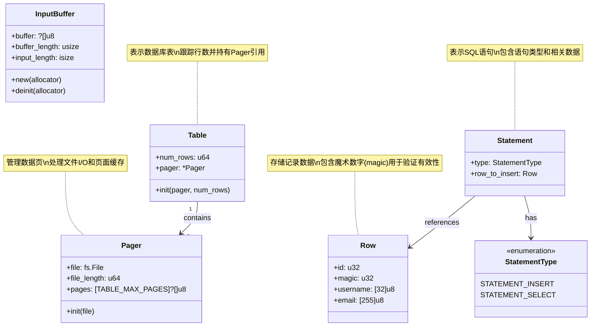

```mermaid
classDiagram
    class InputBuffer {
        +buffer: ?[]u8
        +buffer_length: usize
        +input_length: isize
        +new(allocator)
        +deinit(allocator)
    }

    class Row {
        +id: u32
        +magic: u32
        +username: [32]u8
        +email: [255]u8
    }

    class Pager {
        +file: fs.File
        +file_length: u64
        +pages: [TABLE_MAX_PAGES]?[]u8
        +init(file)
    }

    class Table {
        +num_rows: u64
        +pager: *Pager
        +init(pager, num_rows)
    }

    class Statement {
        +type: StatementType
        +row_to_insert: Row
    }

    class StatementType {
        <<enumeration>>
        STATEMENT_INSERT
        STATEMENT_SELECT
    }

    Table "1" --> "1" Pager : contains
    Statement --> Row : references
    Statement --> StatementType : has

    note for Row "存储记录数据\n包含魔术数字(magic)用于验证有效性"
    note for Pager "管理数据页\n处理文件I/O和页面缓存"
    note for Table "表示数据库表\n跟踪行数并持有Pager引用"
    note for Statement "表示SQL语句\n包含语句类型和相关数据"
```
